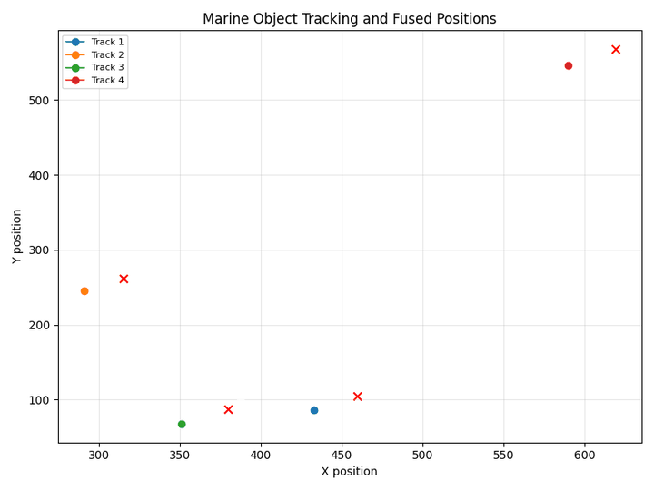
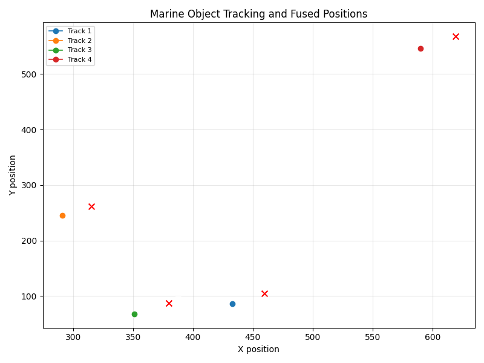

# MAVMRF

[](https://github.com/FratresMedAI/mavmrf/actions/workflows/tests.yml)
[](LICENSE)
[](https://www.python.org/downloads/)
[](https://github.com/astral-sh/ruff)

**Maritime Autonomous Vehicle Monitoring and Response Framework** — a simulation-first Python pipeline for multi-sensor maritime detect, track, and classify.

Built by [Fratres X AI](https://fratres-x.com) — reviewable AI, autonomy, and defensive-technology prototypes with physics-first modeling and conservative maturity labels.

On a fresh clone, monitor mode uses **simulation detections by default** (no YOLO download). YOLO is opt-in via training, `--pretrained`, or `--weights`. There is **no hosted web demo** — clone it, run it, fork it.

> **Layout note:** Application code lives in the [`marmf/`](marmf/) directory; the installable package name is **`mavmrf`**.



*Still frame:* 

## Contents

- [Highlights](#highlights)
- [Local demo (this is the live path)](#local-demo-this-is-the-live-path)
- [Quick start](#quick-start)
- [Detection modes](#detection-modes)
- [Optional: train on synthetic data](#optional-train-on-synthetic-data)
- [Architecture](#architecture)
- [Design decisions and tradeoffs](#design-decisions-and-tradeoffs)
- [What we would change next](#what-we-would-change-next)
- [Seeded benchmark](#seeded-benchmark)
- [Documentation](#documentation)
- [Repository layout](#repository-layout)
- [Tech stack](#tech-stack)
- [Contributing](#contributing)
- [Citation](#citation)
- [Disclaimer](#disclaimer)
- [License](#license)

## Highlights

- **Multi-sensor simulation** — sonar, acoustic, optical, and magnetic streams
- **Honest detection modes** — simulation default; YOLO when trained or explicitly requested
- **Fusion & tracking** — IoU-matched object IDs, weighted fusion, SORT-style tracks
- **Operator outputs** — bearing, estimated range, bearing rate, contact typing, change detection
- **File replay** — JSON frames via `JsonFileSensorAdapter` (`incoming_data/samples/`)
- **Reproducible gates** — seeded benchmark under [`docs/benchmarks/`](docs/benchmarks/)
- **Automated tests** + GitHub Actions CI

## Local demo (this is the live path)

No cloud app. The demo is a local run that writes reports and visualizations under `marmf/reports/`.

```bash
# Windows
cd marmf
scripts\demo.ps1

# Linux / macOS
cd marmf
chmod +x scripts/demo.sh
./scripts/demo.sh
```

Equivalent one-liner after install:

```bash
cd marmf
python main.py --mode monitor --no-trained --duration 10 --num-objects 8
```

Regenerate the README GIF from a short run:

```bash
cd marmf
python main.py --mode monitor --no-trained --duration 3 --num-objects 4
python scripts/make_demo_gif.py
```

## Quick start

```bash
cd marmf
python -m venv .venv

# Windows
.venv\Scripts\activate

# Linux / macOS
# source .venv/bin/activate

pip install -r requirements.txt
pip install -e .
python main.py --mode monitor --duration 10 --num-objects 8 --no-trained
```

From the repo root:

```bash
pip install -e marmf
```

Reports include `detection_source` (`simulation`, `trained`, `pretrained`, or `explicit`).

## Detection modes

| Mode | How to enable |
|------|----------------|
| `simulation` (default) | No flags; uses simulator optical detections |
| `trained` | After `main.py --mode train`; auto-loads `best.pt` |
| `pretrained` | `--pretrained` (downloads `yolov8n.pt`) |
| `explicit` | `--weights PATH` |

Use `--no-trained` to skip auto-loading local trained weights.

## Optional: train on synthetic data

```bash
cd marmf
python scripts/generate_dataset.py --clean
python main.py --mode train
python main.py --mode monitor
```

## Architecture

See [`docs/ARCHITECTURE.md`](docs/ARCHITECTURE.md) for pipeline diagram, module map, extension points, and how MAVMRF sits next to other Fratres X defensive-sensing / contested-autonomy work.

```text
Simulated / file streams → preprocess → detect → track → fuse → report
```

## Design decisions and tradeoffs

**Maturity:** simulation / prototype — not a fielded maritime C2 product.

| Choice | Why | Tradeoff |
|--------|-----|----------|
| Simulation detections by default | Fresh clone stays honest and offline; no silent COCO YOLO download | Optical “detections” are synthetic until you train or pass `--weights` / `--pretrained` |
| IoU match before fusion | Keeps sonar/acoustic/magnetic joins on the same contact when YOLO boxes differ from sim boxes | Assumes overlapping 2D boxes; not a full 3D association layer |
| SORT-style tracker | Fast, reviewable track continuity for demos and gates | No deep appearance re-ID; coasting behavior is deliberately simple |
| Weighted multi-sensor fusion | Makes the multi-modal story concrete in reports | Weights are heuristic, not learned calibration from real sensors |
| Clone-and-run only | Matches Fratres X “you run it, you own the stack” open-source posture | No hosted demo for drive-by clicks |

This thread sits alongside Fratres X work on **defensive sensing** and **contested autonomy**: multi-modal streams, conservative fusion, and outputs you can audit — without claiming operational readiness.

## What we would change next

- Real adapter implementations behind `SensorAdapter` (AIS / acoustic / optical feeds) with recorded replay fixtures
- Association beyond 2D IoU (bearing-range gates, timing uncertainty)
- Calibration / clutter models grounded in measured sensor noise, not only sim knobs
- Stronger track lifecycle metrics (continuity, ID switches) in the seeded benchmark
- Optional Docker one-liner for locked environments — still local, still yours

## Seeded benchmark

Fixed-seed simulation gate (not field performance):

```bash
cd marmf
python scripts/benchmark.py --seed 42 --duration 5 --num-objects 6
```

Results live in [`docs/benchmarks/`](docs/benchmarks/) (`README.md` + `seeded_run.json`).

## Documentation

| Doc | Description |
|-----|-------------|
| [docs/README.md](docs/README.md) | Documentation index |
| [docs/ARCHITECTURE.md](docs/ARCHITECTURE.md) | Pipeline and extension points |
| [docs/benchmarks/](docs/benchmarks/) | Seeded reproducible gates |
| [docs/SOLUTION_BRIEF.md](docs/SOLUTION_BRIEF.md) | Executive narrative |
| [docs/capability_matrix.md](docs/capability_matrix.md) | Capability → evidence |
| [docs/DEMO_SCRIPT_3_MIN.md](docs/DEMO_SCRIPT_3_MIN.md) | Demo script |
| [CHANGELOG.md](CHANGELOG.md) | Release history |
| [SUPPORT.md](SUPPORT.md) | Where to get help |
| [SECURITY.md](SECURITY.md) | Vulnerability reporting |

Full CLI reference: [`marmf/README.md`](marmf/README.md).

## Repository layout

| Path | Description |
|------|-------------|
| [`marmf/`](marmf/) | Core framework (package name `mavmrf`) |
| [`docs/`](docs/) | Architecture, brief, samples, screenshots, benchmarks |
| [`CONTRIBUTING.md`](CONTRIBUTING.md) | Setup, tests, CI |
| [`marmf/tests/`](marmf/tests/) | Pytest suite |

## Tech stack

Python 3.12 · OpenCV · NumPy · Ultralytics (YOLOv8) · PyTorch · Matplotlib · SciPy · pytest · ruff

## Contributing

See [CONTRIBUTING.md](CONTRIBUTING.md). By participating, you agree to the [Code of Conduct](CODE_OF_CONDUCT.md).

## Citation

See [CITATION.cff](CITATION.cff). Prefer the “Cite this repository” button on GitHub when available.

## Disclaimer

Portfolio prototype using **simulated sensor data**. Not intended for operational deployment without live sensor integration and validation. Built for scrutiny — not for inflated claims.

## License

MIT — see [LICENSE](LICENSE).
